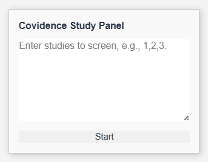

# Covidence Study Navigator (Tampermonkey Userscript)

This Tampermonkey userscript is designed to streamline the screening process in [Covidence](https://www.covidence.org/), a tool commonly used for literature and systematic reviews. In large reviews, researchers are often assigned to screen a range or a randomized set of studies. Covidence allows users to search for one study at a time, but doesn't support easy navigation through a custom list of study IDs, especially when the study IDs are non-consecutive, or they are not located at the top of the study list.

## Features
The script helps users:
- Embedded draggable panel in the Covidence UI.
- Automatically navigate to each study in the list.
- Make Yes/No/Maybe decisions using built-in buttons on the panel.
- Record and log decisions in real time.
- Export screening decisions as a CSV file for tracking or auditing.
- Click on logged study IDs in a summary section to jump directly to a specific study.

#### Front panel:

#### Main panel:

