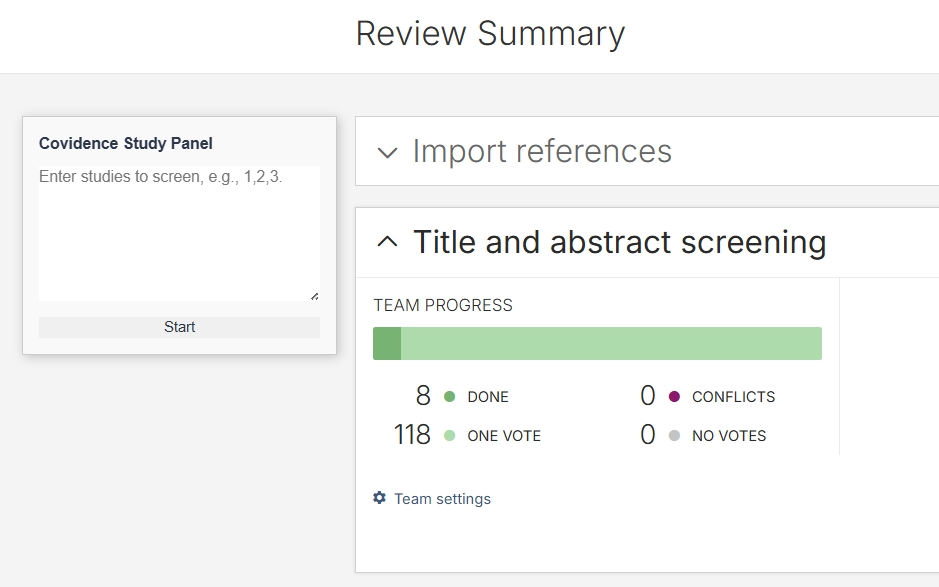
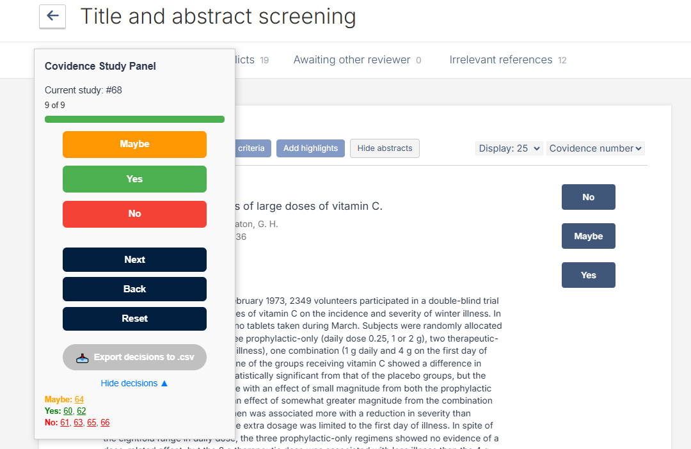
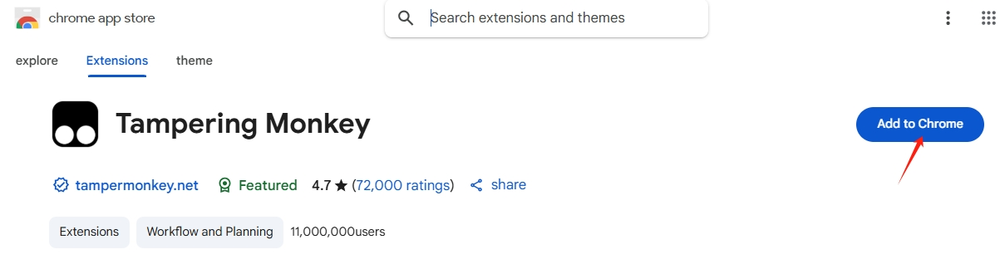
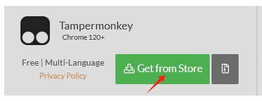
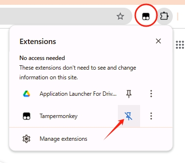
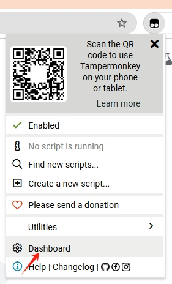
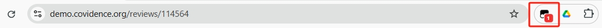

# Covidence Study Navigator (Tampermonkey Script)

This Tampermonkey userscript is designed to streamline the screening process in [Covidence](https://www.covidence.org/), a tool commonly used for literature and systematic reviews. In large reviews, researchers are often assigned to screen a range or a randomized set of studies. Covidence allows users to search for one study at a time, but doesn't support easy navigation through a custom list of study IDs, especially when the study IDs are non-consecutive, or they are not located at the top of the study list.

## Features
The script helps users:
- Embedded draggable panel in the Covidence UI.
- Automatically navigate to each study in the list.
- Make Yes/No/Maybe decisions using built-in buttons on the panel.
- Record and log decisions in real time.
- Export screening decisions as a CSV file for tracking or auditing.
- Click on logged study IDs in a summary section to jump directly to a specific study.

#### Front panel:

#### Main panel:

## How to Install Tampermonkey and Add This Script

### ✅ Step 1: Add Tampermonkey to Chrome  
1. Go to the [Chrome Web Store](https://chrome.google.com/webstore/) and search for **Tampermonkey**.

2. Click **Add to Chrome** on the extension page.

3. Alternatively, visit [tampermonkey.net](https://www.tampermonkey.net/) and click **Get from Store**.

  
---

### ✅ Step 2: Pin Tampermonkey to Your Toolbar  
  

1. Click the puzzle piece icon (Extensions) in the top-right of Chrome.  
2. Find **Tampermonkey** and click the pin icon to keep it visible in your toolbar.

---

### ✅ Step 3: Open the Tampermonkey Dashboard  
  

1. Click the **Tampermonkey** icon in your toolbar.  
2. Choose **Dashboard** from the dropdown menu.

---

### ✅ Step 4: Create a New Userscript  
  

1. In the dashboard, click the **➕ (plus)** icon at the top right to create a new script.  
2. Delete the default code entirely in the code editor and paste the code in **Covidence Study Navigator.user.js** into the code editor and click **File > Save**.
3. Once saved, the script will automatically run whenever you visit Covidence. You should see a red badge on the Tampermonkey icon showing that your userscript is active and running on the page.

  

