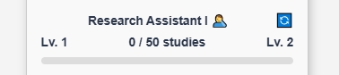
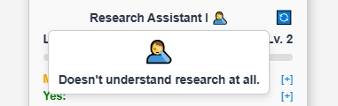

# CoviPanel

**CoviPanel** is a powerful browser extension built for researchers who screen hundreds, if not thousands, of studies on Covidence. Designed to streamline the most tedious part of the systematic review process (title and abstract screen), CoviPanel transforms screening from a repetitive task into a faster, smarter, and even slightly more enjoyable one.

Whether you're reviewing tens, hundreds, or thousands of abstracts, CoviPanel helps you stay focused, work faster, and make more consistent decisions. It combines simplified navigation, real-time progress tracking, and strong AI support—all within a clean, thoughtfully designed, floating panel that stays with you while you work.
<!-- 

-->

And, yes, you can customize the buttons!

  
  
  

## Key Features
- **Flexible, layered interface**
CoviPanel's layered layout lets you expand or collapse individual sections depending on what you need at the moment. Whether you want a clean, minimal view or full access to detailed tools, the interface adapts to your workflow without getting in the way.

  

- **Streamlined navigation**  
  No more scrolling through pages to find your studies. CoviPanel can detect unscreened studies with one click or let you paste a list of study IDs directly from Excel. It then guides you through them one by one in a focused, controlled sequence.

 

<!-- 

 

-->

- **Progress tracking and academic-style gamification**  
  Watch your progress build over time. As you screen, you’ll climb through academic ranks‍—from Research Assistant 🤦‍ to Postdoc 🧔 and eventually reach Full Professor 🧙‍—a small reward system to keep momentum going during long review sessions.

  
  

- **AI-assisted screening (OpenAI API key required)**  
  CoviPanel integrates with ChatGPT to provide a second opinion on each study. It sends the title and abstract to ChatGPT and displays the AI's decision and explanation in the panel. 

- **Decision logging and export to CSV**  
  All your decisions (and ChatGPT's, if enabled) are saved automatically. You can export them at any time in a clean CSV format for record-keeping or analysis.

- **Session and time tracking**  
  CoviPanel tracks how much time you spend screening and computes your average decision speed. You’ll know exactly how long each session takes—and how fast you’re moving through the list.

- **Keyword search and highlighting**  
  You can search for multiple keywords in titles and abstracts and highlight them simultaneously. Frequently used keywords are saved, making repeated searches easier and faster.

- **Custom button appearance styling**  
  Want more personalized, visually appealing YES, NO, and MAYBE buttons? You can upload an image (JPG, PNG, or even GIF) to change the look of the decision buttons to your liking.

