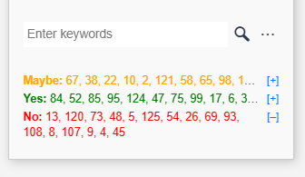
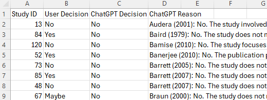

# CoviPanel: A Simple, Gamified, AI-Assisted Tool for Systematic Review

**CoviPanel** is a lightweight browser extension built for researchers who need to screen hundreds or perhaps thousands of references for systematic reviews on Covidence. Designed to streamline one of the most time-consuming parts of the systematic review process‍—title and abstract screen—CoviPanel transforms screening from a repetitive task into a faster, smarter and even a slightly more enjoyable one.

Whether reviewing tens, hundreds or even thousands of abstracts, CoviPanel helps you to remain focused, work faster, and make more consistent decisions. It combines **simplified navigation**, **real-time progress tracking**, and **flexible AI support**—all within a clean, thoughtfully designed, floating panel that stays with you while you work.
<!-- 

-->

And, yes, you can customize the buttons!

  
  
  

## Tutorial

To get started with CoviPanel, follow the tutorials below:

1. **[Install and activate CoviPanel](https://github.com/wnk4242/CoviPanel/wiki/Install-Tampermonkey-and-activate-CoviPanel)**  
   Learn how to install Tampermonkey and get started with CoviPanel for your Covidence projects.

2. **[Generate API key and activate AI Assistant](https://github.com/wnk4242/CoviPanel/wiki/Generate-API-Key-and-Activate-AI-Assistant)**  
   Learn how to set up your OpenAI API key and enable the AI Assistant to help you screen abstracts.
   
3. **[Select studies to start screening](https://github.com/wnk4242/CoviPanel/wiki/Select-studies-to-start-screening)**  
   Learn how to enter study IDs to begin screening with CoviPanel.

4. **[Two most important navigation buttons on CoviPanel: 🖫 (Export and restart) and ◉ (Return)](https://github.com/wnk4242/CoviPanel/wiki/Two-most-important-buttons-on-CoviPanel:-%F0%9F%96%AB-(Export)-and-%E2%97%89-(Return))**  
   Learn how to export decisions to CSV, restart a screening session, and return to the study you were screening.

## Key Features
- **Flexible, layered interface**
CoviPanel's layered layout lets you expand or collapse individual sections depending on what you need at the moment. Whether you want a clean, minimal view or full access to detailed tools, the interface adapts to your workflow without getting in the way.

  

- **Streamlined navigation**  
CoviPanel is especially useful when you're assigned a specific subset of studies to screen (e.g., imagine you're responsible for screening studies #500 to #900). CoviPanel lets you paste a list of study IDs directly from Excel and then guides you through them one by one—no more scrolling through pages to find your studies.

 

<!-- 

 

-->

- **Progress tracking and academic-style gamification**  
  Watch your progress build over time. As you screen, you’ll climb through academic ranks‍—from Research Assistant 🤦‍♂️‍ to Postdoc 🧐 and eventually reach Full Professor 🧙‍—a lightweight yet thoughtfully designed reward system to keep momentum going during long review sessions.

 

<!-- 

| Level | #Papers Screened | Title                | Emoji | Description                          |
|-------|------------------|----------------------|--------|--------------------------------------|
| 1     | 0                | Research Assistant I | 🤦‍♂️   | Doesn't understand research at all.  |
| 2     | 50               | Research Assistant II| 🤷‍♂️   | Still confused but trying.           |
| 3     | 100              | PhD Student 1 Yr.    | 👦     | Newbie in grad school.               |
| 4     | 200              | PhD Student 4 Yr.    | 🧔     | Has a beard of experience.           |
| 5     | 300              | PhD Candidate        | 👴     | Old and wise (but still poor).       |
| 6     | 400              | Dr.                  | 👨‍🎓   | Finally got the title, still no job. |
| 7     | 500              | Postdoc 1 Yr.        | 🙂     | Optimistic researcher.               |
| 8     | 600              | Postdoc 9 Yr.        | 😭     | Send help.                           |
| 9     | 700              | Assistant Prof.      | 👨‍🏫   | Grading forever.                     |
| 10    | 800              | Associate Prof.      | 🦹‍♂️   | Master of committees.                |
| 11    | 900              | Professor            | 🧙‍♂️   | Wizard of academia.                  |
| 12    | 1000             | Emeritus Prof.       | 🥂     | Retired. Toasting to freedom.        |

-->

- **AI-assisted screening (OpenAI API key required)**  
  CoviPanel integrates with ChatGPT to provide a second opinion on each study. It sends the title and abstract to ChatGPT and displays its recommendation and explanation in the panel. 

 

- **Session and time tracking**  
  CoviPanel tracks how much time you spend screening and computes your average decision speed. You’ll know exactly how long each session takes—and how fast you’re moving through the list.

 

- **Keyword search and highlighting**  
  You can search for multiple keywords in titles and abstracts and highlight them simultaneously. Frequently used keywords are saved, making repeated searches easier and faster.

 

- **Custom button appearance styling**  
  Want more personalized, visually appealing YES, NO, and MAYBE buttons? You can upload an image (JPG, PNG, or even GIF) to change the look of the decision buttons to your liking.

 

- **Decision logging and export to CSV**  
  All your decisions (and ChatGPT's, if enabled) are saved automatically. You can export them at any time in a clean CSV format for record-keeping or analysis.

 
 
  

